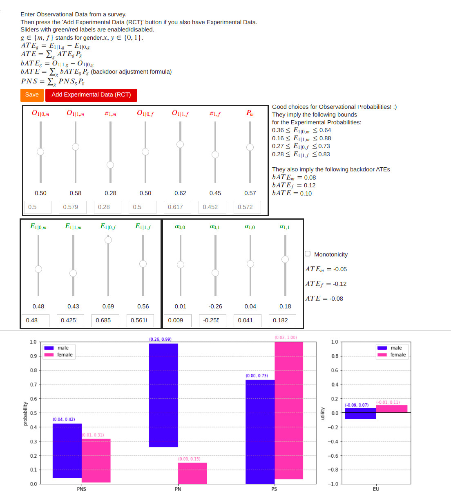

# JudeasRx

## Instructions
* Read the references given in the **Theory and Notation** section below
* Fire up the Jupyter Notebook judeas-rx.ipynb

The notebook draws the GUI (graphical user interface) shown in the above 
jpg. By playing with 
this GUI, you should be able to easily figure out how to use it. If something 
isn't clear,
read the FAQ file.

## Programming Aspects

The above jpg shows the entire GUI. There aren’t 
any other windows to the app. It’s a single window app. The app is written
in Python and runs inside a Jupyter notebook. The controls that you see are 
coded using ipywidgets. The bar graphs change as the sliders move.

## UseCase 
The app considers the simple yet illustrative case of trying to prescribe a 
medicine differently for male versus female patients.  The Rx is based on 
probabilities called PNS, PN and PS and an expected utility function called EU 
that were invented by Pearl and coworkers.

To do a Rx, one first allows the patients to take or not take the drug, 
according to their own discretion. Then one conducts a survey in which one 
collects info about who did or did not take the drug and whether they lived 
or died. This is called Observational Data (OD). Even though OD can be 
confounded, it serves to impose bounds on PNS, PN, PS and EU. After the OD 
stage is completed, one can follow it up with a RCT (Randomized Control 
Experiment). In a RCT, patients must take or not take the drug as ordered 
by the doctor; no insubordination is tolerated. From the RCT, one collects 
Experimental Data (ED). The ED imposes tighter bounds on PNS, PN, PS and 
EU than the bounds imposed by the OD alone.

## Extension to more than two strata
The above GUI handles just two strata, male and female, but JudeasRx can 
handle any 
number n >= 2 of
strata (strata=Z values, where Z is a confounder.) JudeasRx doesn't have a 
GUI for more than two strata. Instead of using sliders for input, 
it uses either Python dictionaries or csv files as input. You can read the doc 
strings 
attached to the Python code to learn how to use that part of JudeasRx. A 
Jupyter notebook with an example with 3 strata is provided.
      
## Extension to Monte Carlo evaluation of bounds for a specific DAG

So far, we have described only how JudeasRx can calculate *analytically* 
bounds for 
PNS, PN and PS, for very broad classes of DAGs (directed acyclc graphs), 
for an arbitrary number of strata.
If 
one assumes a specific DAG, those bounds can be made tighter. JudeasRx can 
also calculate *stochastically* 
bounds for PNS, PN and PS, for a specific DAG, for an arbitrary number of 
strata.
It does this using the very 
mature Python library 
for doing MCMC (Markov Chain Monte Carlo), PyMC3. A Jupyter notebook with 
an example of this is provided.

## Mathematical Theory and Notation 
The mathematical theory and notation are described in gory  but 
entertaining detail in the chapters entitled  “Personalized Treatment 
Effects” and "Personalized Expected Utility" of my book Bayesuvius. Those
chapters are totally based on a paper by 
Tian and Pearl and later work by Pearl, Li and Mueller. My only contribution
(?) 
was to change the notation to a 
more “personalized” notation. [Bayesuvius](https://qbnets.wordpress.com/2020/11/30/my-free-book-bayesuvius-on-bayesian-networks/) is my free, 
open source book (about 570 pages so far) on Bayesian Networks and Causal 
Inference.

